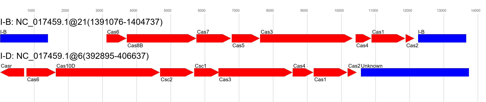
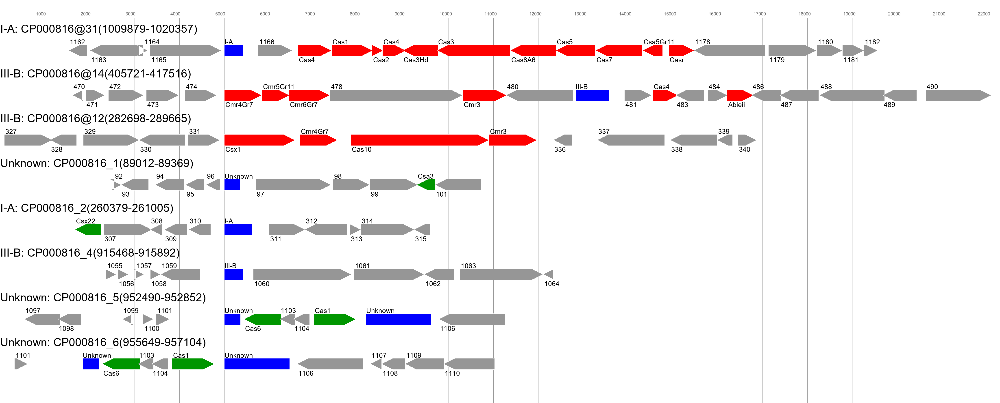

# CasPredict

Detect CRISPR-Cas genes and arrays, and predict the subtype based on both Cas genes and CRISPR repeat sequence.

This software finds Cas genes with a large suite of HMMs, then groups these HMMs into operons, and predicts the subtype of the operons based on a scoring scheme.
Furthermore, it finds CRISPR arrays with [minced](https://github.com/ctSkennerton/minced), and using a kmer-based machine learning approach (extreme gradient boosting trees) it predicts the subtype of the CRISPR arrays based on the consensus repeat. 
It then connects the Cas operons and CRISPR arrays, producing as output:
* CRISPR-Cas loci, with consensus subtype prediction based on both Cas genes (mostly) and CRISPR consensus repeats
* Orphan Cas operons, and their predicted subtype
* Orphan CRISPR arrays, and their predicted associated subtype

#### It includes the following subtypes:
* All the ones in the most recent Nature Reviews Microbiology: [Evolutionary classification of CRISPR–Cas systems: a burst of class 2 and derived variants](https://doi.org/10.1038/s41579-019-0299-x)
* Updated type IV subtypes and variants based on: [Type IV CRISPR–Cas systems are highly diverse and involved in competition between plasmids](https://doi.org/10.1093/nar/gkz1197)
* Type V-K: [RNA-guided DNA insertion with CRISPR-associated transposases](https://doi.org/10.1126/science.aax9181)
* Transposon associated type I-F: [Transposon-encoded CRISPR–Cas systems direct RNA-guided DNA integration](https://doi.org/10.1038/s41586-019-1323-z)

#### It can automatically draw gene maps of CRISPR-Cas systems and orphan Cas operons and CRISPR arrays


# Table of contents
1. [Quick start](#quick)
2. [Installation](#install)
3. [CasPredict - How to](#caspredict)
    * [Plotting](#plot)
4. [RepeatType - How to](#repeattype)

## Quick start <a name="quick"></a>

```sh
conda create -n caspredict -c conda-forge -c bioconda -c russel88 caspredict
conda activate caspredict
caspredict my.fasta my_output
```

## Installation <a name="install"></a>
### Conda
It is advised to use [miniconda](https://docs.conda.io/en/latest/miniconda.html) or [anaconda](https://www.anaconda.com/) to install.

Create the environment with caspredict and all dependencies
```sh
conda create -n caspredict -c conda-forge -c bioconda -c russel88 caspredict
```

### pip
If you have the dependencies (Python >= 3.8, HMMER >= 3.2, Prodigal >= 2.6, grep, sed) in your PATH you can install with pip

```sh
python -m pip install caspredict
```

#### When installing with pip, you need to download the database manually: 
Coming soon...

## CasPredict - How to <a name="caspredict"></a>
CasPredict takes as input a nucleotide fasta, and produces outputs with CRISPR-Cas predictions

#### Activate environment
```sh
conda activate caspredict
```

#### Run with a nucleotide fasta as input
```sh
caspredict genome.fa my_output
```

#### Use multiple threads
```sh
caspredict genome.fa my_output -t 20
```

#### Check the different options
```sh
caspredict -h
```

#### Output
* **CRISPR_Cas.tab:**           CRISPR_Cas loci, with consensus subtype prediction
    * Contains a consensus prediction (Prediction), and the separate predictions for the Cas operon (Prediction_Cas) and CRISPR arrays (Prediction_CRISPRs)
* **cas_operons.tab:**          All certain Cas operons
    * Contains a prediction of subtype (Prediction) and the subtype with the highest score (Best_type). If the score is high then Prediction = Best_type
* **crisprs_all.tab:**          All CRISPR arrays
    * Contains a prediction of the associated subtype based on the repeat sequence (Prediction). 
    * The 'Subtype' column is the subtype with highest probability. Prediction = Subtype if Subtype_probability is high
* **crisprs_orphan.tab:**       Orphan CRISPRs (those not in CRISPR_Cas.tab)
    * Same columns as crisprs_all.tab
* **cas_operons_orphan.tab:**   Orphan Cas operons (those not in CRISPR_Cas.tab)
    * Same columns as cas_operons.tab
* **CRISPR_Cas_putative.tab:**  Putative CRISPR_Cas loci, often lonely Cas genes next to a CRISPR array
    * Same columns as CRISPR_Cas.tab
* **cas_operons_putative.tab:** Putative Cas operons, mostly false positives, but also some ambiguous and partial systems
    * Same columns as cas_operons.tab
* **spacers/*.fa:**             Fasta files with all spacer sequences
* **hmmer.tab:**                All HMM vs. ORF matches, raw unfiltered results
* **genes.tab**                 All genes and their positions
* **arguments.tab:**            File with arguments given to CasPredict

#### Notes on output
Files are only created if there is any data. For example, the crisprs_orphan.tab file is only created if there are any orphan CRISPR arrays.

### Plotting <a name="plot"></a>
CasPredict will automatically plot a map of the CRISPR-Cas loci, orphan Cas operons, and orphan CRISPR arrays.

These maps can be expanded (`--expand N`) by adding unknown genes and genes with alignment scores below the thresholds. This can help in identify potentially un-annotated genes in operon.
* Cas genes are in red.
* Cas genes, with alignment scores below the thresholds, are in dark green
* Unknown genes are in gray (the number matches the genes.tab file)
* Arrays are in blue, with their predicted subtype association based on the consensus repeat sequence.

The plot below is run with `--expand 5`



## RepeatType - How to <a name="repeattype"></a>
With an input of CRISPR repeats (one per line, in a simple textfile) RepeatType will predict the subtype, based on the kmer composition of the repeat

#### Activate environment
```sh
conda activate caspredict
```

#### Run with a simple textfile, containing only CRISPR repeats (in capital letters), one repeat per line.
```sh
repeatType repeats.txt
```

#### Output
The script prints:
* Repeat sequence
* Predicted subtype
* Probability of prediction

#### Notes on output
* Predictions with probabilities below 0.75 are uncertain, and should be taken with a grain of salt.
* The classifier was only trained on the subtypes for which there were enough (>20) repeats. It can therefore only predict subtypes of repeats associated with the following subtypes:
    * I-A, I-B, I-C, I-D, I-E, I-F, I-G
    * II-A, II-B, II-C
    * III-A, III-B, III-C, III-D
    * IV-A1, IV-A2, IV-A3
    * V-A
    * VI-B
* This is the accuracy per subtype (on an unseen test dataset):
    * **I-A**      0.60
    * **I-B**      0.90
    * **I-C**      0.98
    * **I-D**      0.47
    * **I-E**      1.00
    * **I-F**      0.99
    * **I-G**      0.83
    * **II-A**     0.94
    * **II-B**     1.00
    * **II-C**     0.89
    * **III-A**    0.89
    * **III-B**    0.49
    * **III-C**    0.60
    * **III-D**    0.28
    * **IV-A1**    0.79
    * **IV-A2**    0.78
    * **IV-A3**    0.98
    * **V-A**      0.77
    * **VI-B**     1.00


